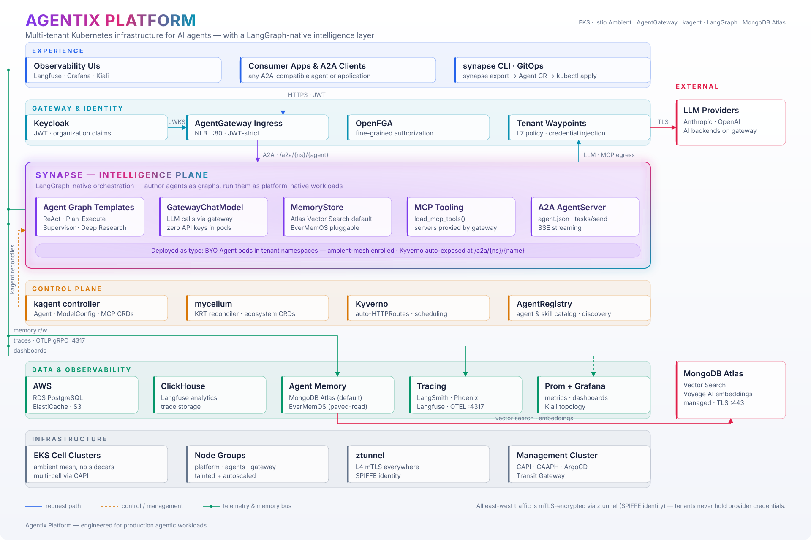
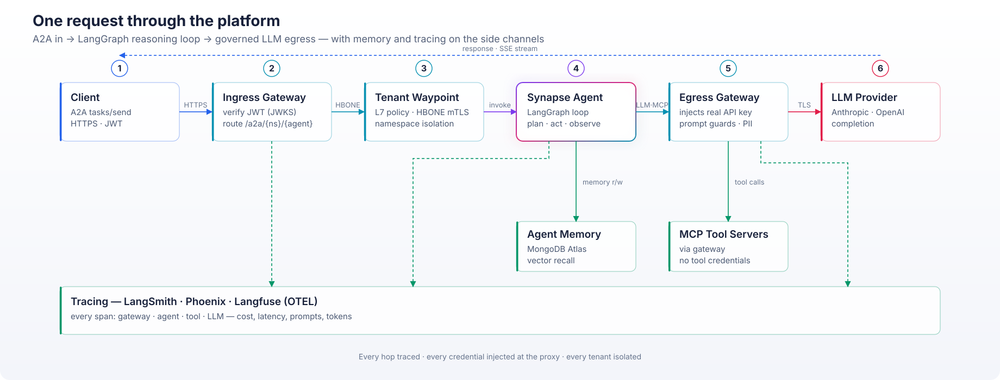

<p align="center">
  <picture>
    <source media="(prefers-color-scheme: dark)" srcset="docs/assets/hero-banner-dark.png"/>
    
  </picture>
</p>

<h1 align="center">Agentix Platform</h1>

<p align="center">
  <strong>Production-grade agentic AI on Kubernetes — author agents as LangGraph graphs,<br/>run them as first-class, mesh-enrolled, gateway-governed workloads.</strong>
</p>

<p align="center">
  <a href="https://www.python.org/"></a>
  <a href="https://langchain-ai.github.io/langgraph/"></a>
  <a href="https://www.mongodb.com/atlas"></a>
  <a href="https://kubernetes.io/"></a>
  <a href="https://istio.io/"></a>
  <a href="LICENSE"></a>
</p>

---

## The problem

Agents are easy to demo and brutally hard to *run*. The moment a prototype
meets production, you inherit a second job: identity, tenant isolation,
credential management, tool governance, observability, cost control — none of
which has anything to do with your agent's actual intelligence.

**Agentix Platform splits that problem cleanly in two:**

- **The platform** solves the infrastructure — EKS, Istio Ambient Mesh,
  AgentGateway, kagent, Keycloak, Kyverno. Identity, isolation, credential
  injection, and observability become properties of the environment, not
  things every agent re-implements.
- **Synapse** — the layer this project adds — solves the *authoring* problem:
  composing models, tools, memory, and other agents into reliable behavior,
  with **LangGraph** as the execution model and the platform as the runtime.

```python
from synapse import AgentCard, AgentServer, GatewayChatModel
from synapse.graphs import create_deep_research_agent
from synapse.memory import AtlasMemoryStore

graph = create_deep_research_agent(
    model=GatewayChatModel(),        # LLM via AgentGateway — zero API keys in the pod
    tools=memory.as_tools(),         # long-term memory the agent can search itself
    name="deep-research",
)

AgentServer(graph, AgentCard(name="deep-research", description="...")).run()
# → serves the A2A protocol; deploy with `synapse export` + kubectl apply
```

## Architecture

<p align="center">
  <a href="docs/diagrams/architecture.svg">
    <picture>
      <source media="(prefers-color-scheme: dark)" srcset="docs/diagrams/architecture.svg"/>
      
    </picture>
  </a><br/>
  <sub>Matches your light/dark mode automatically · click to open full-size — vector, zooms without pixelating.</sub>
</p>

Every request is authenticated at the edge, policy-checked at the tenant
waypoint, executed by a LangGraph agent, and egressed through a gateway that
injects credentials, applies prompt guards, and traces everything.

<p align="center">
  <a href="docs/diagrams/request-flow.svg">
    <picture>
      <source media="(prefers-color-scheme: dark)" srcset="docs/diagrams/request-flow.svg"/>
      
    </picture>
  </a><br/>
  <sub>Matches your light/dark mode automatically · click to open full-size — vector, zooms without pixelating.</sub>
</p>

## The Synapse layer

`synapse/` is a Python package that makes LangGraph agents platform-native.

| Module | What it gives you |
| --- | --- |
| `synapse.graphs` | Four production templates — **ReAct**, **Plan-Execute**, **Supervisor**, **Deep Research** (parallel fan-out via `Send`) |
| `synapse.llm` | `GatewayChatModel` — drop-in `ChatOpenAI` routed through AgentGateway; the pod holds **no provider credentials** |
| `synapse.memory` | Pluggable long-term memory: **MongoDB Atlas Vector Search** (default, with hybrid RRF recall) or **EverMemOS** (platform paved-road) |
| `synapse.tools` | `load_mcp_tools` — MCP tool servers consumed through the gateway, no tool credentials in the workload |
| `synapse.tracing` | **LangSmith**, **Phoenix**, or **Langfuse** — observability as a deployment choice, not a code change |
| `synapse.runtime` | `AgentServer` — any compiled graph becomes an **A2A-protocol** endpoint (agent card, `tasks/send`, SSE streaming) |
| `synapse.cli` | `synapse new` · `synapse serve` · `synapse export` — scaffold, run locally, emit the Kubernetes `Agent` manifest |

## Design decisions (and why they differ from the upstream stack)

This project began from a public reference platform and was deliberately
re-architected at the application layer:

| Layer | Reference stack | **Agentix** | Rationale |
| --- | --- | --- | --- |
| Agent framework | Google ADK examples | **LangGraph 1.x + LangChain** | The industry-standard agent runtime; graph semantics make control flow explicit, testable, and resumable |
| Long-term memory | EverMemOS (MongoDB + Elasticsearch + Milvus + Redis) | **MongoDB Atlas Vector Search** | One store instead of four — documents, vectors, and sessions colocated; hybrid recall via reciprocal rank fusion; Voyage AI embeddings. EverMemOS remains available as a pluggable backend |
| Tracing | Langfuse only | **LangSmith / Phoenix / Langfuse** | LangSmith is LangGraph-native; Phoenix is OSS and OTEL-native; Langfuse stays as the platform paved road |
| Infra backbone | EKS · Istio Ambient · AgentGateway · kagent · Kyverno · Keycloak | **unchanged** | This layer is proven. Differentiation belongs at the application layer, not in reinventing mesh plumbing |

## Repository layout

```
agentix-platform/
├── synapse/                  # the LangGraph orchestration layer (Python)
│   ├── src/synapse/          #   graphs · llm · memory · tools · tracing · runtime · cli
│   ├── tests/                #   31 tests — fully offline, HTTP + ASGI mocked
│   └── examples/deep_research/  # flagship agent: graph + Dockerfile + Agent manifest
├── platform/                 # Kubernetes platform manifests (EKS, Istio, kagent, Keycloak…)
├── scripts/                  # cluster bootstrap & day-2 automation
├── docs/                     # architecture deep-dives and diagrams
└── README.md
```

## Quickstart

**Author and test an agent locally — no cluster required:**

```bash
cd synapse
pip install -e '.[dev,tracing,mcp,atlas]'
pytest                                   # 35 passing, fully offline

synapse new my-agent                     # scaffold
cd my-agent && synapse serve agent:graph # A2A server on :8080
curl -s localhost:8080/.well-known/agent.json | jq
```

**Run the flagship deep-research agent against a local LLM — no cloud, no
API keys** (verified end-to-end: plan → parallel analysts → cited
synthesis, served over A2A with SSE streaming):

```bash
ollama pull llama3.2:3b && ollama serve
cd synapse/examples/deep_research
SYNAPSE_LLM_BASE_URL=http://localhost:11434/v1 SYNAPSE_MODEL=llama3.2:3b \
  SYNAPSE_MEMORY_BACKEND=none python agent.py
```

**Deploy to the platform:**

```bash
synapse export my_agent.agent:graph \
  --image <acct>.dkr.ecr.us-east-1.amazonaws.com/agentix/my-agent:v1 \
  --namespace tenant-alpha -o agent.yaml
kubectl apply -f agent.yaml              # kagent reconciles; Kyverno exposes /a2a/…
```

**Stand up the full platform** (EKS + mesh + gateway + control plane):

```bash
./scripts/bootstrap.sh                   # see docs/ for prerequisites
```

## Quality bar

- **35 unit tests**, all offline — graphs run against fake models, HTTP via
  `respx`, A2A server via in-memory ASGI transport; a guard test AST-scans
  the package to keep every literal centralized in `synapse/constants.py`
- **Live-verified**: real uvicorn boot, agent card, `tasks/send`, and SSE
  streaming — including a full deep-research run on a local Ollama model
- `ruff` clean across source and tests
- Every diagram hand-composed SVG — validated well-formed, rendered and
  visually inspected
- Manifests are real: the deep-research example ships a working
  `kagent.dev/v1alpha2` `Agent` CR + `NetworkPolicy`

## Documentation

- [Architecture deep-dive](docs/architecture.md) — layers, trust boundaries, request lifecycle
- [Synapse guide](docs/synapse.md) — templates, memory backends, tracing, deployment
- [Diagrams](docs/diagrams/) — hand-composed, precision-aligned SVG

## Attribution

Infrastructure patterns adapted from the public
[syn-zhu/agentic-platform](https://github.com/syn-zhu/agentic-platform)
reference. The Synapse layer, memory architecture, tracing abstraction,
examples, tests, diagrams, and documentation are original work. See
[NOTICE](NOTICE).

## License

[Apache-2.0](LICENSE)
